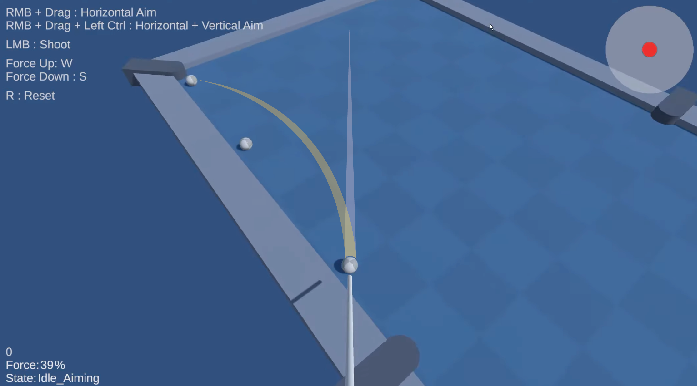

# Pool Testbed & Trickshots

- Unity, C#
- Pool Testbed, Pool Physics for Trick Shots
- Orbit Cam
- Aim and Shoot with Raycast
- Cue Ball Aim Point Selection
- GameManager, State Machine

📹 Preview: [Full Video on YouTube](https://www.youtube.com/watch?v=AVXjzVNj_QY)

